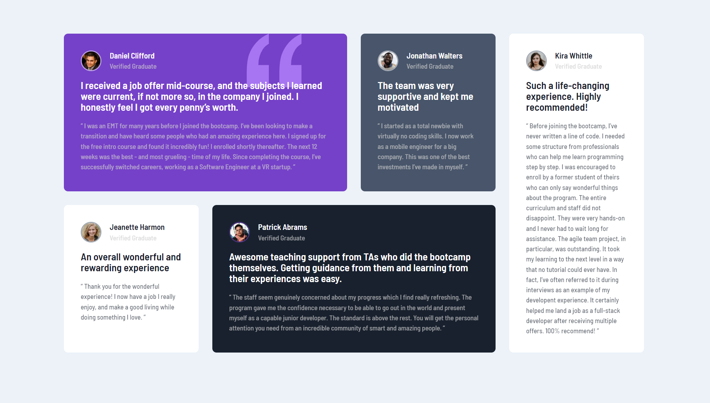

# Frontend Mentor - Four card feature section solution

This is a solution to the [Testimonials grid section challenge on Frontend Mentor](https://www.frontendmentor.io/challenges/testimonials-grid-section-Nnw6J7Un7). Frontend Mentor challenges help you improve your coding skills by building realistic projects.

## Table of contents

-   [Overview](#overview)
    -   [The challenge](#the-challenge)
    -   [Screenshot](#screenshot)
    -   [Links](#links)
-   [My process](#my-process)
    -   [Built with](#built-with)
    -   [Useful resources](#useful-resources)
-   [Author](#author)

## Overview

### The challenge

Users should be able to:

-   View the optimal layout for the site depending on their device's screen size

### Screenshot

### Links

-   [Solution URL](https://www.frontendmentor.io/solutions/four-card-feature-section-oQetO3tqvV)
-   [Live Site URL](https://waragismynickname.github.io/four-card-feature-section/)

## My process

### Built with

-   Semantic HTML5 markup
-   CSS custom properties
-   Flexbox
-   Mobile-first workflow

### Useful resources

-   [Doka-guide](https://doka.guide/css/) - This helped me for CSS.

## Author

-   Frontend Mentor - [@WaRaGiSmYnIcKnAmE](https://www.frontendmentor.io/profile/WaRaGiSmYnIcKnAmE)
